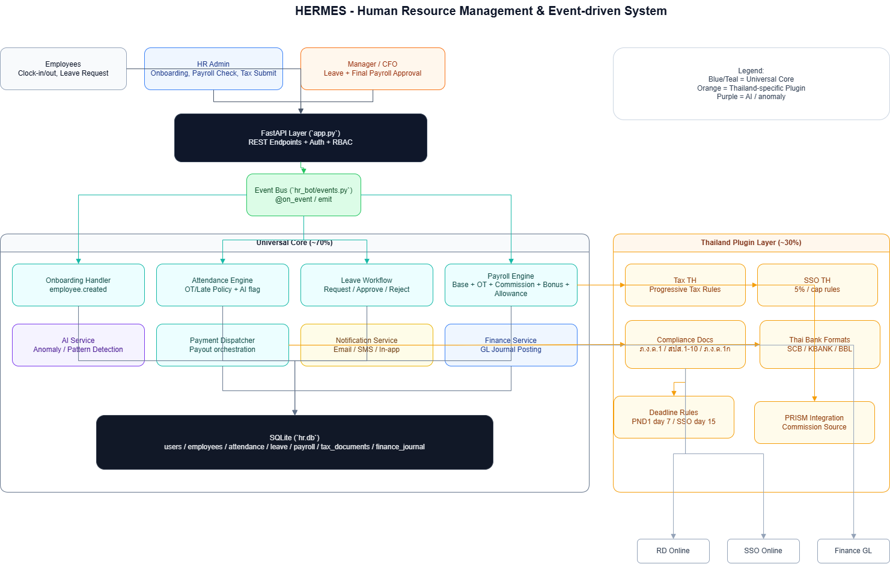

# HERMES - Human Resource Management & Event-driven System

**HERMES** is a sample HR workflow platform using **AI + Human in the Loop + Code Bot** across 5 phases:
Onboarding → Attendance/Leave → Payroll → Payment → Tax/SSO



## Quick Start

```bash
pip install -r requirements.txt
uvicorn app:app --reload
```

- Swagger UI: http://127.0.0.1:8000/docs
- ReDoc: http://127.0.0.1:8000/redoc

The system uses SQLite and creates `hr.db` automatically in the same folder as `app.py`.

## Docker

### Build and Run (Docker CLI)

```bash
docker build -t hermes-api:latest .
docker run --name hermes-api -p 8000:8000 -v ${PWD}/hr.db:/app/hr.db hermes-api:latest
```

### Build and Run (Docker Compose)

```bash
docker compose up --build -d
```

Stop services:

```bash
docker compose down
```

## Current Structure (Core + Plugin Concept)

The project is being refactored into **Universal Layer** and **Thailand-Specific Layer**.

- `app.py` = API layer (backward-compatible endpoints)
- `hr_bot/handlers/` = Code Bot logic by workflow module
  - `event_handler.py` (onboarding event)
  - `attendance_engine.py`
  - `leave_updater.py`
  - `payroll_engine.py`
  - `payment_dispatcher.py`
  - `tax_document_generator.py`
- `hr_bot/services/` = service layer
  - `ai_service.py`, `notify_service.py`, `finance_service.py`
  - `bank_file_builder.py`, `payslip_service.py`, `tax_builders.py`, `deadline_service.py`
- `hr_bot/events.py` = lightweight event bus (`@on_event`, `emit`)
- `IMPLEMENTATION_CHECKLIST.md` = execution plan for Universal Core / Thailand Plugin separation

> Note: this is currently a transition architecture toward multi-country support.

## Universal vs Thailand-Specific (Current)

### Universal (Should Be Core)
- Event-driven workflow
- Human approval checkpoints
- Attendance/Leave workflow
- Payroll aggregation framework
- AI anomaly framework
- Notification channels
- Finance GL posting framework

### Thailand-Specific (Should Be Plugin)
- PND1 / PND1KOR / SSO 1-10
- RD Online / SSO Online flow
- Thai progressive tax + social security rules
- SCB / KBANK / BBL bank file format
- Deadline day 7 (PND1), day 15 (SSO)
- PRISM commission integration

## Auth (Bearer Token)

Many endpoints require a token.

1) Create the first user (allowed once without a token)

```bash
curl -X POST "http://127.0.0.1:8000/auth/register?role=hr_admin" \
  -H "Content-Type: application/json" \
  -d '{"username":"hr","password":"hr1234"}'
```

2) Login to get a token

```bash
curl -X POST http://127.0.0.1:8000/auth/login \
  -H "Content-Type: application/json" \
  -d '{"username":"hr","password":"hr1234"}'
```

3) Call authenticated endpoints

```bash
curl http://127.0.0.1:8000/auth/me \
  -H "Authorization: Bearer <TOKEN>"
```

## Main Endpoints by Phase

### Phase 1: Onboarding
- `POST /employees` create a new employee + trigger `employee.created`
- `GET /employees`
- `GET /employees/{emp_id}`

### Phase 2: Attendance & Leave
- `POST /attendance/clock_out` record clock out + policy check + AI flag
- `GET /attendance/{emp_id}`
- `POST /leave` submit leave request
- `POST /leave/{leave_id}/decision` manager/CFO approve or reject
- `GET /leave/pending/all`

### Phase 3: Payroll
- `POST /payroll/run` run payroll batch + AI anomaly summary
- `POST /payroll/{payroll_id}/hr_approve`
- `POST /payroll/{payroll_id}/cfo_approve`
- `GET /payroll/{payroll_id}`

### Phase 4: Payment
- `POST /payment/dispatch` create bank transfer files + payslips + GL journal
- `GET /finance/journal`

### Phase 5: Tax & SSO
- `POST /tax/generate` generate tax/social security documents
- `POST /tax/{doc_id}/submit` HR confirms submission

### Dashboard
- `GET /dashboard/summary`

## Test Reports

The project includes two latest test report sets:

1) End-to-End Functional Test  
- Report file: `TEST_REPORT_2026-04-29.md`  
- Raw result: `test_report_raw.json`  
- Script: `run_detailed_tests.py`  
- Summary: `20/20 PASS` (Auth, Onboarding, Attendance, Leave, Payroll, Payment, Tax, Dashboard)

2) Production Gap Test (Year-end + Concurrency focus)  
- Result file: `production_gap_report.json`  
- Script: `run_production_gap_tests.py`  
- Summary: `3/3 PASS`
  - Year-end month 12 generates annual tax form (`PND1KOR`)
  - Concurrent attendance insert behaves correctly (1 success + remaining rejects)
  - Concurrent payment dispatch is controlled to prevent duplicate payout (1 success + remaining rejects)

### Re-run Tests

```bash
python run_detailed_tests.py
python run_production_gap_tests.py
```

## Important Notes

- This project is a demo/reference implementation and is not production-ready yet.
- Recommended production hardening:
  - database migrations
  - secure auth, token expiration, token refresh
  - real async job queue + scheduler
  - real external integrations (bank, tax, SSO, finance)
